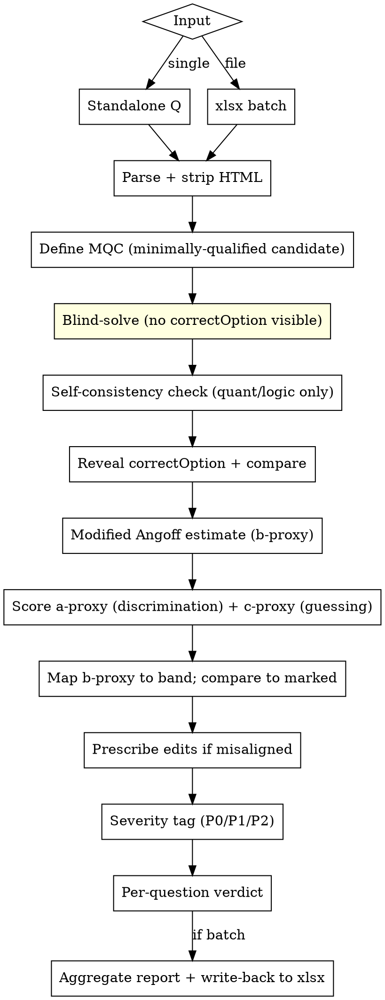

# QC Questions — Correctness & IRT-Aligned Difficulty Audit

## Overview

High-stakes IRT-aligned assessment questions fail in four ways: (1) marked answer is wrong, (2) marked answer is one of *several* defensible answers, (3) the item's pre-calibration difficulty (proxy-b) does not match the tagged band, (4) the item has poor discrimination (proxy-a) or inflated guessing floor (proxy-c) and will produce noisy IRT parameters once deployed. This skill catches all four with a **blind-solve protocol** (you commit to your answer before seeing `correctOption`) and an **IRT-aligned rubric**: Modified Angoff for difficulty, distractor-functioning analysis for discrimination, and effective-options counting for guessing-resistance — with concrete edit prescriptions.

**Core principle:** Solve each question as if you were the minimally-qualified candidate (MQC), *blind to the answer key*. Then estimate item difficulty by Modified Angoff (% of MQCs who would get it right), score discrimination and guessing-resistance, and compare to the marked band. This is the single most important rule in the skill — it prevents the LLM's default "rationalize the marked answer" failure mode and replaces vibes-based difficulty calls with IRT-consistent estimation.

## When to Use

- User mentions QC, audit, review, or verification of an assessment question bank
- User points at a `.xlsx` with columns: `content`, `option1..option6`, `correctOption`, `questionType`, `subject`, `topics`, `difficulty`
- User asks "is this question correct?" for a single standalone MCQ
- User wants difficulty calibration ("is this really EASY?")
- Any context involving "high-stakes assessment", "bulk upload", "question bank"

**Do NOT use for:** writing new questions (different skill), grading candidate responses, or open-ended/essay items.

## Mandatory Headers (xlsx input)

`content` · `option1` · `option2` · `option3` · `option4` · `option5` · `option6` · `correctOption` · `questionType` · `subject` · `topics` · `difficulty`

Optional columns are preserved untouched. `option5`/`option6` may be empty. `content` and options may contain HTML (`<p>`, `<br>`, `<sup>`, `<sub>`, `<table>`) — strip tags before solving but render math/code faithfully.

## Workflow



## The Seven Hard Rules

1. **Blind solve.** Read `content` + options ONLY. Hide `correctOption` from your working memory until after you commit. No peeking — see [QC_PROTOCOL.md](QC_PROTOCOL.md) for the discipline.
2. **Self-consistency for quant/logic.** Solve numerical/logical items by two independent methods. If they disagree, flag P0 — your own answer is unreliable, escalate to human.
3. **Difficulty is IRT-anchored, not vibes.** Use Modified Angoff for the b-proxy plus discrimination (a-proxy) and pseudo-guessing (c-proxy) scoring per [DIFFICULTY_RUBRIC.md](DIFFICULTY_RUBRIC.md). Never tag "MEDIUM because it feels medium".
4. **State the MQC.** Difficulty is defined relative to the **minimally-qualified candidate** (MQC) for the assessment — the candidate sitting at the cut score. Write the MQC definition in `qc_notes` for every verdict. If the MQC isn't obvious from `subject`/`topics`, ask once at session start and reuse.
5. **Edits must be concrete and minimal.** If misaligned, output the exact text to add/remove/swap, not "make it harder". Prescriptions library is in the rubric file, mapped to which IRT proxy each edit moves. **Every NEEDS_EDITS row MUST carry at least one concrete edit in `proposed_edits`. Empty edits are only allowed when `confidence: LOW` AND the obstruction is external to the QC pipeline (missing chart, malformed source cell). Flagging drift for human review is a failure mode — the subagent has full content visibility, so it must write the edit.**
6. **Ambiguous or low-discrimination = block ship.** Two defensible answers, no defensible answer, contradictory stem, or a-proxy ≤ 2 all become at-least-P1 verdicts even if `correctOption` happens to match yours. Construct-alignment failure is P0.
7. **`subject`, `topics`, and `difficulty` are the SPEC, not editable fields.** The marked tags define what this question is supposed to be — they are immutable targets. Never propose an edit that changes them. If the item drifts away from its tags, edit the `content` / `option1..option6` / `correctOption` to pull it BACK to the marked subject, topic, and difficulty band. Retagging would silently change the bank composition; the PM planned a specific count per `(subject, topic, difficulty)` cell and the QC must respect that plan. If the item is so far from its tags that it cannot be aligned without a from-scratch rewrite (e.g., a quant problem marked Verbal Ability), flag `confidence: LOW` and the `correctness_issue` becomes "construct mismatch — escalate" — do NOT silently retag.

## Output — What the User Sees

IRT (Modified Angoff + a-proxy + c-proxy) is the **internal reasoning method**, not the deliverable. The deliverable is:

**Autonomous-by-default.** The Corrected sheet is fully self-applying — every NEEDS_EDITS row at HIGH or MED confidence ships with the prescribed edits already written into the cells. Only LOW-confidence rows are held back un-edited for human review (typically construct mismatch, missing chart, or another external obstruction the QC pipeline genuinely cannot fix). The skill never flags drift for a human reviewer when the subagent had full content visibility — that is treated as a regression, surfaced by the writer with a red fill and a stderr warning.

**For xlsx batch input:** a single output workbook with three sheets.
1. The **original sheet** is preserved verbatim, with two new audit columns appended:
   - `qc_status` — `ALIGNED` or `NEEDS_EDITS`, colour-coded for at-a-glance scanning (green / amber / red-on-LOW-confidence).
   - `qc_changes` — a human-readable narrative for every `NEEDS_EDITS` row: a `CORRECTNESS:` section (omitted when null), a `DIFFICULTY:` section (omitted when null), then an `EDITS APPLIED:` block listing each edit as `• <field>: <why>`. Rows where confidence is `LOW` and no edits were auto-applied carry `EDITS: none auto-applied — human review required`. The cell mirrors the `qc_status` fill colour and is wrap-text formatted so the whole story is readable in one column.
2. A **`QC Legend`** sheet — small colour key explaining what each fill means in the original and Corrected sheets.
3. A **`Corrected` sheet** with the same headers as the original (no audit columns). It is the **production-ready post-QC source of truth** and can be uploaded as-is:
   - **`ALIGNED` rows** carry the original row content **verbatim** (copied from the input sheet) with a green fill. The PM can drop the fills and re-upload directly.
   - **`NEEDS_EDITS` rows** show the post-edit content for the whole row (original values + edits applied), with an amber row fill and dark-amber + bold on the specific cells that changed. Plain-text edits to `content` / `option1..option6` are auto-wrapped in `<p>…</p>` to match the platform's HTML expectation.
   - **`NEEDS_EDITS` rows with `confidence: LOW`** use a red row fill instead of amber and carry the original content un-edited (human reviewer to decide).
   - The marked `subject`, `topics`, and `difficulty` columns are NEVER changed by the QC — they are the spec the item must match.

**For standalone questions:** a single YAML verdict block listing (a) what's off and (b) the exact edits to align it to the marked subject/topic/difficulty.

In both modes the per-question reasoning is:

1. **What's off** (correctness issue, difficulty issue, or both — empty if nothing).
2. **The exact edits** needed to make `correctOption` correct AND make the item land in the marked `difficulty` band, while staying within the marked `subject` and `topics`.

### Editable vs Immutable fields

| Field | Status | Why |
|---|---|---|
| `content` (stem)               | editable    | Adjust to land in marked difficulty band, fix ambiguity |
| `option1..option6`             | editable    | Strengthen distractors, fix multiple-correct, remove giveaways |
| `correctOption`                | editable    | Fix marked-key errors |
| `subject`                      | **immutable** | The PM planned this many items per subject; never silently rebalance |
| `topics`                       | **immutable** | Same; topic taxonomy is the spec |
| `difficulty` (EASY/MEDIUM/HARD)| **immutable** | The PM planned the band distribution; never silently rebalance |
| `questionType`, `tags`, etc.   | **immutable** | Metadata, not under QC scope |

If a verdict's `edits` list contains any operation that targets an immutable field, the writer logs a warning and ignores the edit. The skill's prescriptions are written to never target these fields.

### Per-Question Verdict Schema (output)

```yaml
- row: <int or "standalone">
  status: ALIGNED | NEEDS_EDITS
  correctness_issue: <one-line description or null>
  difficulty_issue: <one-line description or null>
  edits:
    - field: <stem | option1..option6 | correctOption | difficulty>
      from: "<exact current value>"
      to:   "<exact replacement value>"
      why:  "<one-line reason: fixes correctness | aligns to <BAND> | both>"
  confidence: HIGH | MED | LOW    # LOW means escalate to human; do not auto-apply
```

Rules:
- `ALIGNED` rows have empty `edits` and both issues `null`. No noise.
- Every `edit` is directly applicable to the xlsx cell — copy `to` into the cell, done.
- If only difficulty is off → one edit on the `difficulty` field, OR a set of stem/option edits that shift the item into the marked band. Show **one path**, not both. Pick the path that costs fewer changes; mention the alternative in `why` only if relevant.
- If correctness AND difficulty are off → list correctness edits first, then any further difficulty edits that survive after the correctness fix.
- `confidence: LOW` → emit edits but mark for human review. Don't auto-apply.

### Internal Severity (used only for prioritising the aggregate report)

| Severity | When |
|---|---|
| `must_fix` | correctness_issue is set, OR difficulty mismatch on an EASY tag in a screening assessment, OR confidence: LOW |
| `should_fix` | other difficulty mismatches, weak distractors, floor items |
| `polish` | wording / formatting only |

Severity does not appear in the per-row output unless the user asks for it; it drives the order of the aggregate report.

## Workflow — Standalone Question

```
1. Receive question text + all options + metadata.
2. Run QC_PROTOCOL.md step-by-step (blind solve → reveal → difficulty score → edits).
3. Emit a single verdict block matching REPORT_TEMPLATE.md.
```

## Workflow — xlsx Batch (MANDATORY: parallel subagents)

Parallel subagent dispatch is **not optional** for batch QC. The main agent's context has seen every `correctOption` during xlsx parsing — only a fresh subagent context can do a structurally-blind solve. Speed is a bonus; correctness is the reason.

```
1. Establish MQC for this assessment.
   - If user has provided it: use verbatim.
   - If not: infer from subject/topics and confirm in one line.

2. python3 scripts/qc_xlsx.py read <path>   # strips HTML, prints normalised JSON
   - Questions go into the "questions" list (NO correctOption).
   - Keys go into a separate "_keys" block. DO NOT leak _keys into subagent prompts.

3. Split the questions into batches of 5–8 rows each.
   - Default: 6 rows per batch.
   - 18 rows → 3 batches. 100 rows → ~17 batches.
   - Write each batch to /tmp/qc_batch<N>.json (questions only).
   - Write /tmp/qc_keys.json with the keys (main-agent use only).

4. Dispatch ALL subagent batches in a SINGLE message (multiple Agent tool calls in
   parallel, one per batch). Use the canonical prompt in SUBAGENT_PROMPT.md.
   - Each subagent reads only its batch file and never the keys file.
   - Each returns a JSON array: per-row {my_answer, my_reasoning, multiple_correct_risk,
     ambiguity_risk, angoff_pct, angoff_reasoning, proxy_a, proxy_c, confidence}.
   - Cap parallel dispatch at ~10 subagents per message; queue the rest.

5. Main agent collects subagent outputs, reveals correctOption per row, composes
   lean verdicts per QC_PROTOCOL.md Step 7. Write verdicts.json.

6. python3 scripts/qc_xlsx.py write <input.xlsx> verdicts.json <output.xlsx>
   - Original sheet: + two audit columns
       'qc_status'  — ALIGNED | NEEDS_EDITS, colour-coded.
       'qc_changes' — narrative of what's off + every edit applied, wrap-text,
                      fill mirrors qc_status.
   - New 'Corrected' sheet: production-ready post-QC output.
       ALIGNED rows are the original content verbatim, green-filled.
       NEEDS_EDITS rows have edits applied in-cell (correctOption flipped,
       text rewritten; <p>…</p> auto-wrap for content/option fields),
       amber row fill with dark-amber+bold on changed cells.
       LOW-confidence rows are red-filled with original content (escalate).

7. Emit aggregate report (REPORT_TEMPLATE.md) — counts by status, must-fix-first
   list, low-confidence escalations.
```

**Three rules that make this work:**

1. **Strip-then-batch:** the parse script in step 2 holds `correctOption` separate. The main agent never writes `correctOption` into a subagent prompt.
2. **Parallel in one message:** all batches dispatched as multiple Agent tool calls inside one message run concurrently. Sequential dispatch defeats the speedup.
3. **Subagent prompt is canonical:** use the template in [SUBAGENT_PROMPT.md](SUBAGENT_PROMPT.md) verbatim, only substituting `<MQC>`, `<BATCH_FILE_PATH>`, `<KEYS_FILE_PATH>`. Do not paraphrase — paraphrasing has historically led to leakage of the "infer the marked answer" pattern.

## Common Mistakes

| Mistake | Fix |
|---|---|
| Reading `correctOption` first then "checking" it | Strip it from input before solving. Use the script. |
| Tagging difficulty by topic name ("calculus = HARD") | Estimate Angoff_pct for the stated MQC; let the band fall out of the table. |
| Not stating the MQC | Difficulty is meaningless without an MQC anchor. State it in every verdict. |
| Defaulting Angoff to 50% when unsure | A refusal-to-estimate. Pick a side and write your reasoning. |
| Skipping a-proxy / c-proxy because difficulty was aligned | Low a or high c are independent ship-blockers (P1). Always score all three. |
| Flagging drift without a concrete distractor rewrite | The subagent has full content visibility. Write the edit, do not defer to a human. |
| Marking LOW_CONFIDENCE as OK | LOW_CONFIDENCE is P0 — your QC is the high-stakes gate. |
| Skipping self-consistency on quant items | Two independent methods is non-negotiable for numerical questions. |
| Treating HTML tags as content | Strip before reading; preserve math/code/tables. |
| Solving in the same context as the answer key | Use subagents for batch; mentally cover the key for standalone. |

## Files in This Skill

- `SKILL.md` — this file (overview + workflow)
- `QC_PROTOCOL.md` — step-by-step blind-solve protocol with rationalization counters
- `DIFFICULTY_RUBRIC.md` — IRT-aligned rubric (Modified Angoff + a-proxy + c-proxy + edit prescription library)
- `SUBAGENT_PROMPT.md` — canonical prompt template for blind-solve subagents (mandatory for batch QC)
- `REPORT_TEMPLATE.md` — exact output schema (lean per-row + aggregate)
- `scripts/qc_xlsx.py` — xlsx I/O: `read` holds back `correctOption`; `write` produces a three-sheet workbook (Original + `qc_status` + `qc_changes` audit columns, QC Legend, Corrected sheet which is production-ready — ALIGNED rows verbatim, NEEDS_EDITS rows with edits applied in-cell)
