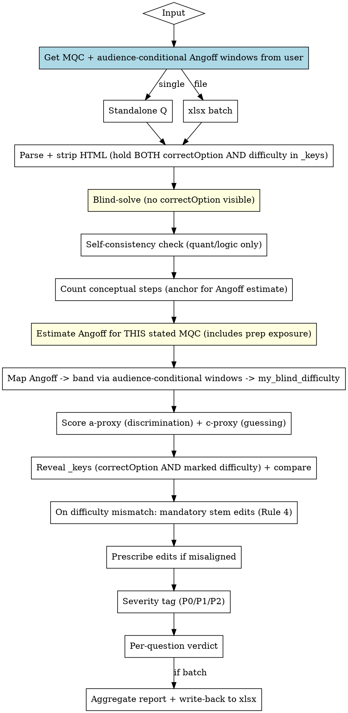

# QC Questions — Correctness & IRT-Aligned Difficulty Audit

## Overview

High-stakes IRT-aligned assessment questions fail in four ways: (1) marked answer is wrong, (2) marked answer is one of *several* defensible answers, (3) the item's pre-calibration difficulty (proxy-b) does not match the tagged band, (4) the item has poor discrimination (proxy-a) or inflated guessing floor (proxy-c) and will produce noisy IRT parameters once deployed. This skill catches all four with a **blind-solve protocol** (you commit to your answer before seeing `correctOption`) and an **IRT-aligned rubric**: Modified Angoff for difficulty, distractor-functioning analysis for discrimination, and effective-options counting for guessing-resistance — with concrete edit prescriptions.

**Core principle:** Solve each question as if you were the minimally-qualified candidate (MQC), *blind to the answer key*. Then score difficulty by **counting conceptual steps in the canonical solve** (intrinsic complexity — the b-parameter), score discrimination by analysing distractor quality (the a-parameter), and compare each to its layer. **Difficulty is fixed by stem rewrites; discrimination is fixed by distractor edits. The two layers are independent and must never be confused.** This is the single most important rule in the skill — it prevents both the LLM's default "rationalize the marked answer" failure mode AND the more subtle "swap a distractor to fake difficulty" parameter-contamination mode.

## When to Use

- User mentions QC, audit, review, or verification of an assessment question bank
- User points at a `.xlsx` with columns: `content`, `option1..option6`, `correctOption`, `questionType`, `subject`, `topics`, `difficulty`
- User asks "is this question correct?" for a single standalone MCQ
- User wants difficulty calibration ("is this really EASY?")
- Any context involving "high-stakes assessment", "bulk upload", "question bank"

**Do NOT use for:** writing new questions (different skill), grading candidate responses, or open-ended/essay items.

## Mandatory Headers (xlsx input)

`content` · `option1` · `option2` · `option3` · `option4` · `option5` · `option6` · `correctOption` · `questionType` · `subject` · `topics` · `difficulty`

Optional columns are preserved untouched. `option5`/`option6` may be empty. `content` and options may contain HTML (`<p>`, `<br>`, `<sup>`, `<sub>`, `<table>`) — strip tags before solving but render math/code faithfully.

## Workflow



## Hard Rules

1. **Blind solve.** The subagent reads `content` + options + `subject` + `topics` + `questionType` ONLY. `scripts/qc_xlsx.py read` holds back BOTH `correctOption` AND `difficulty` in a separate `_keys` block; subagent prompts are built from the questions list only (`_keys` never leaks into a subagent prompt). The subagent commits (a) an answer AND (b) a difficulty rating for EVERY row before the main agent reveals `_keys`. See [QC_PROTOCOL.md](QC_PROTOCOL.md).
2. **Self-consistency for quant/logic.** Solve numerical/logical items by two independent methods. If they disagree, flag P0 — your own answer is unreliable, escalate to human.
3. **Difficulty is the Angoff band predicted for the stated MQC, anchored by conceptual-step count.** EASY/MEDIUM/HARD are defined operationally as Angoff windows for the stated audience: what fraction of the MQC cohort would solve correctly. The conceptual-step count from the canonical solve is the **anchor** that makes the Angoff estimate defensible (without it, Angoff is vibes) — but the band itself comes from Angoff-for-this-audience, NOT from the step count directly. **The same 2-step item is HARD for tier-3, MEDIUM for tier-2, and EASY for tier-1**, because their respective Angoff %s land in different windows. See Rule 7 for audience-conditional window defaults, [DIFFICULTY_RUBRIC.md](DIFFICULTY_RUBRIC.md) for the step-counting rubric.
4. **Blind difficulty rating, then reveal, then mandatory alignment on mismatch.** The subagent commits a blind band (EASY/MEDIUM/HARD) per row by (a) counting conceptual steps in the canonical solve as the anchor, then (b) estimating Angoff for the stated MQC including the cohort's prep exposure / pattern familiarity, then (c) mapping the estimate to a band via the audience-conditional Angoff windows. All this BEFORE the main agent opens `_keys`. After reveal, the main agent compares blind rating to marked band:
   - **Match** → ALIGNED on the difficulty layer. No difficulty edit.
   - **Mismatch** → **every effort must be made to align the item via STEM edits** (add a conceptual step to shift Angoff downward when the item is too easy for the audience, remove one to shift Angoff upward when the item is too hard). Use the prescription library in [DIFFICULTY_RUBRIC.md](DIFFICULTY_RUBRIC.md). The marked band is the spec for expected behaviour FOR THIS AUDIENCE; the blind rating is the audit signal that the item won't behave that way. **Re-rating the item to match the marked tag is NOT alignment — that is the rationalization failure on difficulty, analogous to "rationalize the marked answer" on correctness. The blind rating wins as the diagnostic; the marked band wins as the target.** Only flag `confidence: LOW` and emit no difficulty edit if the gap is so large that aligning it requires more than a one-band stem shift (e.g., a 1-step item that tier 1 would solve at 92% but is marked HARD for tier 1 = 10-15% Angoff target → that's a 2+ band gap that cannot be bridged with one stem-add).
   - **Dead constraints** → If the stem contains DEAD CONSTRAINTS (constraints that don't filter the solution set, per [QC_PROTOCOL.md](QC_PROTOCOL.md) Step 5b-bis), the alignment edit MUST tighten the constraint into load-bearing OR remove it. A stem rewrite that adds a NEW dead constraint is itself a defect — the subagent's alignment_prescriptions emit MUST be self-checked against the dead-constraint rule before passing through.
4-bis. **Two-band gaps trigger blueprint review, not just an item-level escalation.** A blind rating that's two bands from the marked tag (e.g., blind EASY against marked HARD for tier-1) signals that the test author's calibration of what HARD means for the stated audience is broken, not just that one item drifted. The per-row verdict still emits `confidence: LOW` with no auto-edit (the gap can't be bridged by a single stem shift) — but the AGGREGATE REPORT must surface the pattern. If > 20% of items in any (subject, topic) section show 2-band gaps in the same direction (all overrated or all underrated), the section's blueprint itself needs recalibration. Add a `blueprint_review` flag at the top of the aggregate report naming the affected section and direction. Same-direction matters: 4 items all overrated for tier-1 is a tag-calibration problem; 2 overrated + 2 underrated is item-level noise.
6. **Layer separation is non-negotiable.** Difficulty (b) lives in the STEM. Discrimination (a) and guessing-floor (c) live in the DISTRACTORS. When difficulty is mismatched → **rewrite the stem** to add or remove a conceptual step. NEVER swap a distractor to "fix" difficulty — distractor swaps move empirical p-value via carelessness-catching but do NOT change the latent b-parameter. That is parameter contamination. Distractor edits are reserved for proxy_a / proxy_c failures.
7. **State the MQC — it determines the Angoff windows.** Difficulty is conditioned on the **minimally-qualified candidate** (MQC) for the assessment — the candidate sitting at the cut score the assessment is designed to enforce. The MQC determines what Angoff % maps to which band; without an MQC, the skill cannot grade items. Write the MQC definition in `qc_notes` for every verdict. **If the MQC isn't provided at invocation, the skill ASKS once at session start and refuses to proceed without it — it does not infer a default MQC, because the wrong MQC produces silently wrong verdicts.** Suggested defaults (override when the user has different conventions):

   | Audience | HARD Angoff window | MEDIUM | EASY |
   |---|---|---|---|
   | **Tier 1** (IIT / NIT / top-tier engineering, CAT-style prep saturated) | 10–25% | 40–65% | 80–95% |
   | **Tier 2** (state engineering, regional B-schools, moderate prep) | 25–45% | 50–70% | 75–90% |
   | **Tier 3** (entry-level IT services, broad screening, light prep) | 35–55% | 55–75% | 75–95% |
   | **General / unknown** | 25–50% | 50–75% | 75–95% |

   Tier-1 HARD = 10-25% specifically because tier-1 candidates have seen most standard CAT / aptitude patterns in prep; to genuinely separate the top 15% from the rest, items must operate above the routine-pattern recognition layer. The skill USES these windows actively in Stage 5d (band mapping); the user can override at invocation with explicit windows.
8. **Edits must be concrete and minimal.** If misaligned, output the exact text to add/remove/swap, not "make it harder". Prescriptions library is in the rubric file, mapped to which IRT proxy each edit moves. **Every NEEDS_EDITS row MUST carry at least one concrete edit in `proposed_edits`. Empty edits are only allowed when `confidence: LOW` AND the obstruction is external to the QC pipeline (missing chart, malformed source cell, construct mismatch, or a difficulty gap too large to bridge without a from-scratch rewrite per Rule 4). Flagging drift for human review is a failure mode — the subagent has full content visibility, so it must write the edit.**
9. **Ambiguous or low-discrimination = block ship.** Two defensible answers, no defensible answer, contradictory stem, or a-proxy ≤ 2 all become at-least-P1 verdicts even if `correctOption` happens to match yours. Construct-alignment failure is P0.
10. **`subject`, `topics`, and `difficulty` are the SPEC, not editable fields.** The marked tags define what this question is supposed to be — they are immutable targets. Never propose an edit that changes them. If the item drifts away from its tags, edit the `content` / `option1..option6` / `correctOption` to pull it BACK to the marked subject, topic, and difficulty band. Retagging would silently change the bank composition; the PM planned a specific count per `(subject, topic, difficulty)` cell and the QC must respect that plan. If the item is so far from its tags that it cannot be aligned without a from-scratch rewrite (e.g., a quant problem marked Verbal Ability), flag `confidence: LOW` and the `correctness_issue` becomes "construct mismatch — escalate" — do NOT silently retag.

## Output — What the User Sees

IRT (Modified Angoff + a-proxy + c-proxy) is the **internal reasoning method**, not the deliverable. The deliverable is:

**Autonomous-by-default.** The Corrected sheet is fully self-applying — every NEEDS_EDITS row at HIGH or MED confidence ships with the prescribed edits already written into the cells. Only LOW-confidence rows are held back un-edited for human review (typically construct mismatch, missing chart, or another external obstruction the QC pipeline genuinely cannot fix). The skill never flags drift for a human reviewer when the subagent had full content visibility — that is treated as a regression, surfaced by the writer with a red fill and a stderr warning.

**For xlsx batch input:** a single output workbook with three sheets.
1. The **original sheet** is preserved verbatim, with two new audit columns appended:
   - `qc_status` — `ALIGNED` or `NEEDS_EDITS`, colour-coded for at-a-glance scanning (green / amber / red-on-LOW-confidence).
   - `qc_changes` — a human-readable narrative for every `NEEDS_EDITS` row: a `CORRECTNESS:` section (omitted when null), a `DIFFICULTY:` section (omitted when null), then an `EDITS APPLIED:` block listing each edit as `• <field>: <why>`. Rows where confidence is `LOW` and no edits were auto-applied carry `EDITS: none auto-applied — human review required`. The cell mirrors the `qc_status` fill colour and is wrap-text formatted so the whole story is readable in one column.
2. A **`QC Legend`** sheet — small colour key explaining what each fill means in the original and Corrected sheets.
3. A **`Corrected` sheet** with the same headers as the original (no audit columns). It is the **production-ready post-QC source of truth** and can be uploaded as-is:
   - **`ALIGNED` rows** carry the original row content **verbatim** (copied from the input sheet) with a green fill. The PM can drop the fills and re-upload directly.
   - **`NEEDS_EDITS` rows** show the post-edit content for the whole row (original values + edits applied), with an amber row fill and dark-amber + bold on the specific cells that changed. Plain-text edits to `content` / `option1..option6` are auto-wrapped in `<p>…</p>` to match the platform's HTML expectation.
   - **`NEEDS_EDITS` rows with `confidence: LOW`** use a red row fill instead of amber and carry the original content un-edited (human reviewer to decide).
   - The marked `subject`, `topics`, and `difficulty` columns are NEVER changed by the QC — they are the spec the item must match.

**For standalone questions:** a single YAML verdict block listing (a) what's off and (b) the exact edits to align it to the marked subject/topic/difficulty.

In both modes the per-question reasoning is:

1. **What's off** (correctness issue, difficulty issue, or both — empty if nothing).
2. **The exact edits** needed to make `correctOption` correct AND make the item land in the marked `difficulty` band, while staying within the marked `subject` and `topics`.

### Editable vs Immutable fields

| Field | Status | Why |
|---|---|---|
| `content` (stem)               | editable    | Adjust to land in marked difficulty band, fix ambiguity |
| `option1..option6`             | editable    | Strengthen distractors, fix multiple-correct, remove giveaways |
| `correctOption`                | editable    | Fix marked-key errors |
| `subject`                      | **immutable** | The PM planned this many items per subject; never silently rebalance |
| `topics`                       | **immutable** | Same; topic taxonomy is the spec |
| `difficulty` (EASY/MEDIUM/HARD)| **immutable** | The PM planned the band distribution; never silently rebalance |
| `questionType`, `tags`, etc.   | **immutable** | Metadata, not under QC scope |

If a verdict's `edits` list contains any operation that targets an immutable field, the writer logs a warning and ignores the edit. The skill's prescriptions are written to never target these fields.

### Per-Question Verdict Schema (output)

```yaml
- row: <int or "standalone">
  status: ALIGNED | NEEDS_EDITS
  correctness_issue: <one-line description or null>
  difficulty_issue: <one-line description or null>
  edits:
    - field: <stem | option1..option6 | correctOption | difficulty>
      from: "<exact current value>"
      to:   "<exact replacement value>"
      why:  "<one-line reason: fixes correctness | aligns to <BAND> | both>"
  confidence: HIGH | MED | LOW    # LOW means escalate to human; do not auto-apply
```

Rules:
- `ALIGNED` rows have empty `edits` and both issues `null`. No noise.
- Every `edit` is directly applicable to the xlsx cell — copy `to` into the cell, done.
- If only difficulty is off → one edit on the `difficulty` field, OR a set of stem/option edits that shift the item into the marked band. Show **one path**, not both. Pick the path that costs fewer changes; mention the alternative in `why` only if relevant.
- If correctness AND difficulty are off → list correctness edits first, then any further difficulty edits that survive after the correctness fix.
- `confidence: LOW` → emit edits but mark for human review. Don't auto-apply.

### Internal Severity (used only for prioritising the aggregate report)

| Severity | When |
|---|---|
| `must_fix` | correctness_issue is set, OR difficulty mismatch on an EASY tag in a screening assessment, OR confidence: LOW |
| `should_fix` | other difficulty mismatches, weak distractors, floor items |
| `polish` | wording / formatting only |

Severity does not appear in the per-row output unless the user asks for it; it drives the order of the aggregate report.

## Workflow — Standalone Question

```
1. Receive question text + all options + metadata.
2. Run QC_PROTOCOL.md step-by-step (blind solve → reveal → difficulty score → edits).
3. Emit a single verdict block matching REPORT_TEMPLATE.md.
```

## Workflow — xlsx Batch (MANDATORY: parallel subagents)

Parallel subagent dispatch is **not optional** for batch QC. The main agent's context has seen every `correctOption` AND every marked `difficulty` during xlsx parsing — only a fresh subagent context can do a structurally-blind solve AND a structurally-blind difficulty rating. Speed is a bonus; correctness is the reason.

```
1. Establish MQC for this assessment.
   - If user has provided it: use verbatim.
   - If not: infer from subject/topics and confirm in one line.

2. python3 scripts/qc_xlsx.py read <path>   # strips HTML, prints normalised JSON
   - Questions go into the "questions" list (NO correctOption, NO difficulty).
   - Keys go into a separate "_keys" block (correctOption + marked difficulty per row).
   - DO NOT leak _keys into subagent prompts — both fields are audit targets.

3. Split the questions into batches of 5–8 rows each.
   - Default: 6 rows per batch.
   - 18 rows → 3 batches. 100 rows → ~17 batches.
   - Write each batch to /tmp/qc_batch<N>.json (questions only — neither
     correctOption nor difficulty present).
   - Write /tmp/qc_keys.json with the keys (main-agent use only).

4. Dispatch ALL subagent batches in a SINGLE message (multiple Agent tool calls in
   parallel, one per batch). Use the canonical prompt in SUBAGENT_PROMPT.md.
   - Each subagent reads only its batch file and never the keys file.
   - Each returns a JSON array: per-row {my_answer, my_reasoning, multiple_correct_risk,
     ambiguity_risk, my_blind_difficulty, conceptual_steps, conceptual_steps_note,
     angoff_pct, angoff_reasoning, proxy_a, proxy_c, proposed_edits, confidence}.
   - The subagent commits BOTH a blind answer AND a blind difficulty band per row
     before its prompt completes. Neither field is in its input.
   - Cap parallel dispatch at ~10 subagents per message; queue the rest.

5. Main agent collects subagent outputs, reveals BOTH correctOption AND marked
   difficulty per row from _keys, composes lean verdicts per QC_PROTOCOL.md Step 7.
   On difficulty mismatch (subagent's my_blind_difficulty ≠ marked difficulty),
   pass-through the subagent's stem-edit prescription per Rule 4 — do NOT re-rate
   the item to match the marked band, do NOT silently retag. Write verdicts.json.

6. python3 scripts/qc_xlsx.py write <input.xlsx> verdicts.json <output.xlsx>
   - Original sheet: + two audit columns
       'qc_status'  — ALIGNED | NEEDS_EDITS, colour-coded.
       'qc_changes' — narrative of what's off + every edit applied, wrap-text,
                      fill mirrors qc_status.
   - New 'Corrected' sheet: production-ready post-QC output.
       ALIGNED rows are the original content verbatim, green-filled.
       NEEDS_EDITS rows have edits applied in-cell (correctOption flipped,
       text rewritten; <p>…</p> auto-wrap for content/option fields),
       amber row fill with dark-amber+bold on changed cells.
       LOW-confidence rows are red-filled with original content (escalate).

7. Emit aggregate report (REPORT_TEMPLATE.md) — counts by status, must-fix-first
   list, low-confidence escalations. **AND if any section has >20% items
   2-band-gapped in the same direction, surface the blueprint_review flag at
   the TOP of the report with the section name + direction + counts. This is
   a tag-calibration problem at the bank level, not a per-item fix.**
```

**Three rules that make this work:**

1. **Strip-then-batch:** the parse script in step 2 holds BOTH `correctOption` and marked `difficulty` separate. The main agent never writes either field into a subagent prompt — both are audit targets the subagent must commit blind.
2. **Parallel in one message:** all batches dispatched as multiple Agent tool calls inside one message run concurrently. Sequential dispatch defeats the speedup.
3. **Subagent prompt is canonical:** use the template in [SUBAGENT_PROMPT.md](SUBAGENT_PROMPT.md) verbatim, only substituting `<MQC>`, `<BATCH_FILE_PATH>`, `<KEYS_FILE_PATH>`. Do not paraphrase — paraphrasing has historically led to leakage of the "infer the marked answer" pattern.

### Cost discipline (preserve quality, cut tokens)

The blind-solve discipline is the quality floor — it cannot be optimised away. Everything else can be tuned.

| Lever | Rule | Why it's safe |
|---|---|---|
| **Batch size** | Default 6 rows per subagent. For files ≤ 8 rows, use a single subagent over the whole file. Never 1-per-row. | Amortizes the prompt load across rows; the subagent's context is still fresh per batch and never sees `correctOption` or marked `difficulty`. |
| **Model routing** | Subagent workers and verifiers run on **Sonnet** (`model: "sonnet"` on the Agent tool). Main agent (composer) runs on the conversation's default (typically Opus). | Sonnet is plenty for MCQ solve + intrinsic-complexity scoring; the discipline lives in the prompt, not in raw model capability. Sonnet is ~5x cheaper. |
| **Verifier batching** | One verifier subagent handles all `NEEDS_EDITS` rows in a batch, not one verifier per row. | Same blind-solve guarantee; the verifier never sees the marked key, just the post-edit cell values. |
| **Skip verification when no answer-affecting edit** | If the only edits in a verdict are distractor swaps that don't touch `correctOption`, verification can be skipped (correctness is structurally unchanged). | The regression risk is in answer-changing edits (stem rewrite, key flip); distractor-only edits are mechanically safe. |
| **Canonical prompt** | Use the template in [SUBAGENT_PROMPT.md](SUBAGENT_PROMPT.md) verbatim. Do not pad with extra context the subagent doesn't need. | Trimming has been done in the canonical template; further "helpful" additions usually leak the answer key. |

**Concrete cost profile** (7-row CSV, 1 NEEDS_EDITS row, with the discipline above):

- 1 batched blind-solve subagent on Sonnet (≈ 2k tokens out)
- 1 batched verifier subagent on Sonnet for the NEEDS_EDITS rows (≈ 1.5k tokens out)
- Main agent on Opus for composition (≈ 3-5k tokens)
- **Total: ~7-9k tokens** vs. the per-row-Opus pattern's ~25-30k tokens. ~70% cheaper, same audit quality.

## Common Mistakes

| Mistake | Fix |
|---|---|
| Reading `correctOption` or marked `difficulty` first then "checking" them | Strip BOTH from input before solving. Use the script — it holds both in `_keys`. |
| Rating difficulty intrinsically and ignoring the stated MQC | The same 2-step item is HARD for tier-3, MEDIUM for tier-2, EASY for tier-1. Intrinsic step count is the ANCHOR; Angoff-for-this-MQC is the BAND. If the user said tier-1, rate against tier-1. |
| Proceeding without an MQC | The skill refuses. Ask once. Without an MQC the windows aren't anchored, and every verdict is silently wrong. |
| Tagging difficulty by topic name ("calculus = HARD") or by conceptual-step count alone | Step count is the anchor, not the band. The band comes from where the Angoff-for-MQC estimate lands in the audience-conditional windows. |
| **Re-rating an item to match the marked band after reveal** | Rationalization failure on difficulty (same shape as "rationalize the marked answer"). The subagent's blind rating is the audit signal — if it disagrees with the marked band, that's drift, and the fix is a STEM edit to close the gap, not a re-rate. |
| Letting a difficulty mismatch slide because "the marked band is roughly right" | Rule 4: mismatch triggers mandatory stem-edit effort. "Close enough" on band tags compounds at bank level — 100 items each off by half a band shifts the assessment's whole θ curve. |
| Treating 2-band gaps as just bigger versions of 1-band gaps and prescribing a stem edit anyway | A 2-band gap is a different KIND of failure — it signals broken calibration, not item drift. Single stem-add cannot defensibly bridge 2 bands. Per-row escalates as confidence: LOW, no auto-edit. AGGREGATE reports the blueprint_review flag when >20% of a section is 2-band-gapped in the same direction. |
| **Swapping a distractor to "fix" a difficulty mismatch** | Parameter contamination. Difficulty is fixed in the STEM (add/remove a conceptual step). Distractor edits move discrimination, not difficulty. |
| Calling an item ALIGNED because Angoff "feels right" despite intrinsic complexity not matching the band | Stage-1 intrinsic complexity is the source of truth. If Angoff agrees with the marked band only because sharp distractors are catching carelessness, the item is still mistagged — rewrite the stem. |
| Not stating the MQC | Difficulty is meaningless without an MQC anchor. State it in every verdict. |
| Defaulting Angoff to 50% when unsure | A refusal-to-estimate. Pick a side and write your reasoning. |
| Skipping a-proxy / c-proxy because difficulty was aligned | Low a or high c are independent ship-blockers (P1). Always score all three. |
| Flagging drift without a concrete edit | The subagent has full content visibility. Write the edit, do not defer to a human. LOW + empty edits is reserved for genuinely external obstructions (missing chart, construct mismatch). |
| Marking LOW_CONFIDENCE as OK | LOW_CONFIDENCE is P0 — your QC is the high-stakes gate. |
| Skipping self-consistency on quant items | Two independent methods is non-negotiable for numerical questions. |
| Treating HTML tags as content | Strip before reading; preserve math/code/tables. |
| Solving in the same context as the answer key | Use subagents for batch; mentally cover the key for standalone. |

## Files in This Skill

- `SKILL.md` — this file (overview + workflow)
- `QC_PROTOCOL.md` — step-by-step blind-solve protocol with rationalization counters
- `DIFFICULTY_RUBRIC.md` — IRT-aligned rubric (Modified Angoff + a-proxy + c-proxy + edit prescription library)
- `SUBAGENT_PROMPT.md` — canonical prompt template for blind-solve subagents (mandatory for batch QC)
- `REPORT_TEMPLATE.md` — exact output schema (lean per-row + aggregate)
- `scripts/qc_xlsx.py` — xlsx I/O: `read` holds back `correctOption`; `write` produces a three-sheet workbook (Original + `qc_status` + `qc_changes` audit columns, QC Legend, Corrected sheet which is production-ready — ALIGNED rows verbatim, NEEDS_EDITS rows with edits applied in-cell)
